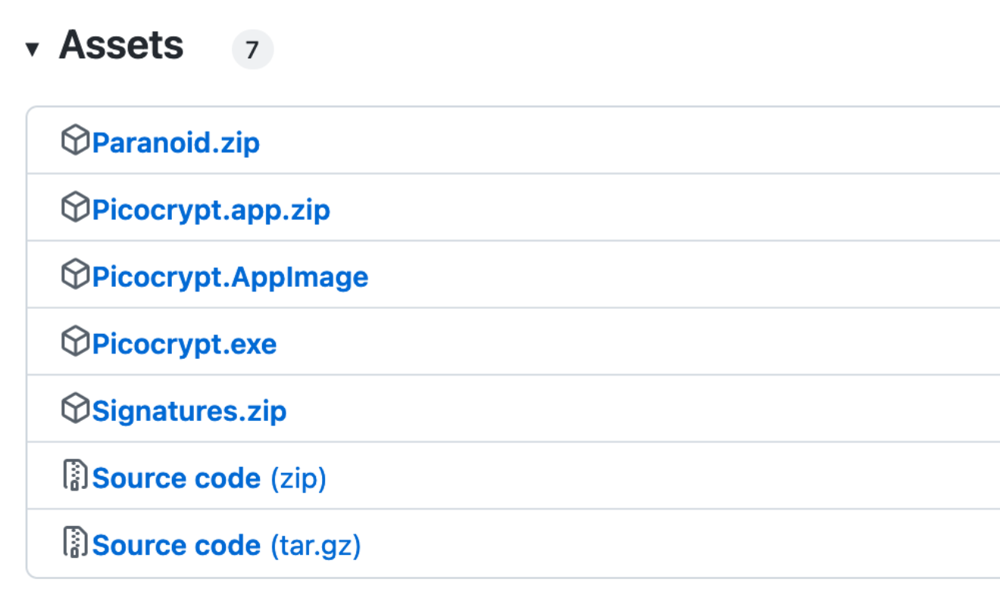
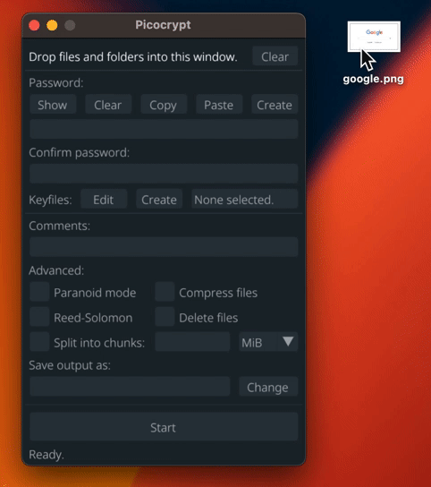

秘密の写真やキーファイルなど、細かいファイル単位の「他人に見られたくないファイルをパスワードで暗号化して保存したい」みたいなことがあると思います。

Windows Home版や外付けHDD, USBのデータは暗号化なし状態で保存されていることがほとんどで、ドライブへの物理的アクセスが可能であればすぐに秘密のファイルが見られてしまいます。また、クラウドストレージでもエンドツーエンド暗号化(E2EE)が実装されているサービスは少なく(有名どころでiCloudの[高度なデータ保護](https://support.apple.com/ja-jp/HT212520))、サービスプロバイダがファイルを閲覧することが事実上可能になっています。

全てのファイルとはいかなくとも、機密ファイルだけはパスワードで暗号化して自分だけがアクセスできるようにしたいという需要が生まれます。その最初のやり方としてまず**パスワード付き圧縮ファイル**にすることがあげられます。7-Zipなどのソフトウェアを使えば、圧縮するついでに安全な暗号化をすることでセキュリティを確保することができます。

## Picocrypt

そして、別のソフトウェアとしてこの記事で紹介するPicocryptは、7-ZipやVeraCryptなどと同じくファイル暗号化機能を提供するものです。7-Zipの機能を使えば圧縮のおまけ機能として暗号化ができますが、これは**暗号化専用ソフト**になっています。

## メリットと使い道

 メリットは、以下の通りです。

- 完全なオープンソース
- セットアップ・暗号化が簡単
- ファイルサイズが極小(3MB)
- セキュリティ第一の設計

VeraCryptとは違い、特別な領域のセットアップなどが不要で、ファイルを**ドラッグ&ドロップで簡単に暗号化**できる設計になっているので、用途としては単体だったり小さめのファイルを暗号化するのに向いています。

- フルディスクを暗号化したいならBitLocker(FileVault)またはVeraCrypt
- クラウドでファイルシステムのように使いたい場合はCryptomator
- モバイルで使う予定があるなら有料のCryptomator
- 小さいファイルや単体で暗号化したい場合はPicoCrypt
- クロスプラットフォームで簡単に使えるGUIが欲しいならPicoCrypt
- セキュリティを重視する場合はPicoCrypt

という感じですね。「2段階認証の回復キーを暗号化してUSBに保存したい」みたいな時もVeraCryptで別途領域を作るよりはPicoCryptで作った方が楽かもしれません。生成されるのは原則一つのファイルなので、それを**コピーするだけでバックアップ**も取れます。

## 導入方法

[PicoCryptのGithub Releasesページ](https://github.com/HACKERALERT/Picocrypt/releases)にアクセスします。お使いのOSにあった最新バージョンのものをダウンロードしてください。Windowsなら`.exe`、MacOSなら`.app.zip`のものをダウンロードします。

## 基本的な使い方

### 暗号化

Picocryptを起動すると、以下のような画面になっていると思います。

暗号化したいファイルをウィンドウ内にドラッグ&ドロップします。

するとパスワードが入力できるようになるので、自分が忘れない強固なパスワードを入力してください。また「Create」ボタンから新しいパスワードをランダムに生成することもできます。

一番下は保存先です。デフォルトでは同じパスに `ファイル名.元拡張子.pcv` の形式のファイルとして保存されます。「Change」ボタンから指定した保存先を選択することができます。

最後に「Encrypt」ボタンをクリックするとファイルの暗号化が開始されます。ローエンドのノートPCで1GBの複数の動画ファイルを暗号化してみましたが、標準の設定では20秒程度で完了しました。

### 復号(pcvファイルを元に戻す)

同じようにpcvファイルをウィンドウ内にドラッグ&ドロップして、パスワード欄に設定したパスワードを入力して「Decrypt」ボタンを押せば暗号化を解除することができます。

## 高度な使い方

ここからは他の暗号化ソフトではできないセキュリティを強化するPicocryptの使い方を紹介します。

### キーファイル

パスワードだけではなく、**自分だけが持っているファイル**(キーファイル)を使って暗号化することができます。
自分だけが持っている画像などのファイルでも、新たに生成することもできます。
チームで使う場合は、それぞれ1人ずつキーファイルを所持し、全員がいないと開けられないという構成にすることもできます。

Keyfilesの「Edit」ボタンを押して、出てきたダイアログにキーファイルをドラッグ&ドロップします。「Create」でランダムなキーファイルを作れます。

### Paranoid mode

複数の暗号化方式を使用するなどして最高レベルの暗号化をすることができます。ただし、公式でも言われているように、処理速度が遅くなるので、政府機関や脅威にさらされている内部告発者でない限り必要性はあまりないと思われます。

### ファイル圧縮

「Compress files」のチェックを入れればzipで圧縮してくれます。

### Reed-Solomon

[リード・ソロモン符号](https://ja.wikipedia.org/wiki/%E3%83%AA%E3%83%BC%E3%83%89%E3%83%BB%E3%82%BD%E3%83%AD%E3%83%A2%E3%83%B3%E7%AC%A6%E5%8F%B7)を使用して最大3%ファイルが破損しても誤り修正をすることができる設定です。暗号化と復号化に著しく時間がかかるので、クラウドや外部HDDに長期保存するのに向いています。

### Delete files

復号化する際ファイルの改竄が検知された場合に自動的に削除するオプションです。

### ファイルの分割

「Split into chunks」オプションはファイルを指定した単位で分割することができます。

## まとめ

以上がPicocryptの使い方になります。言語が英語のみの対応になっているので抵抗感がありますが、他のソフトよりも簡単にファイルを暗号化できるので、PC1台に1つは導入しておくと良いのではないでしょうか。