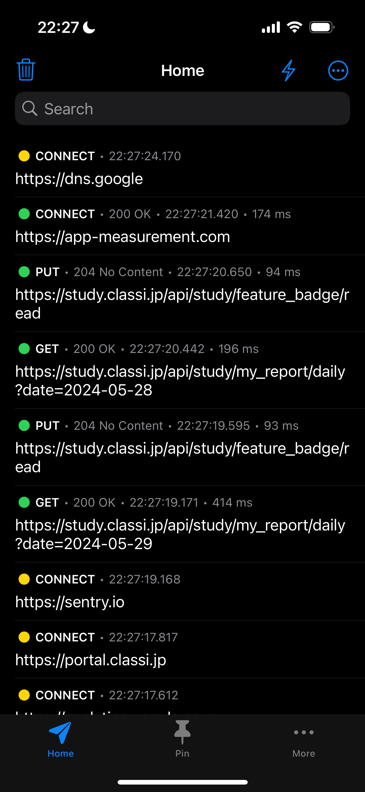
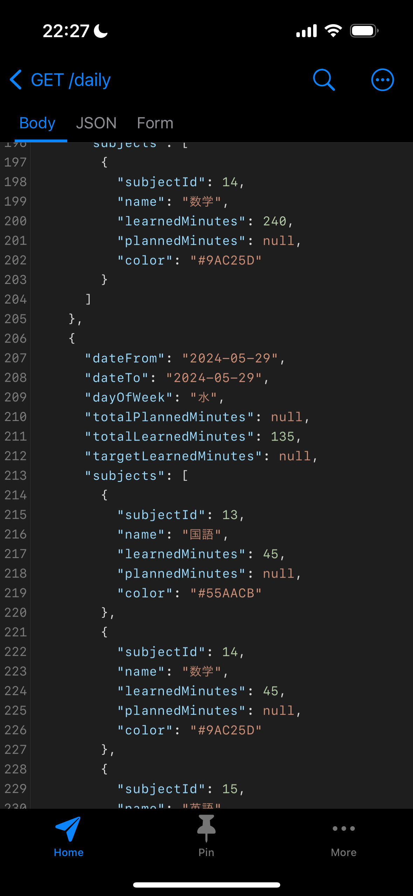
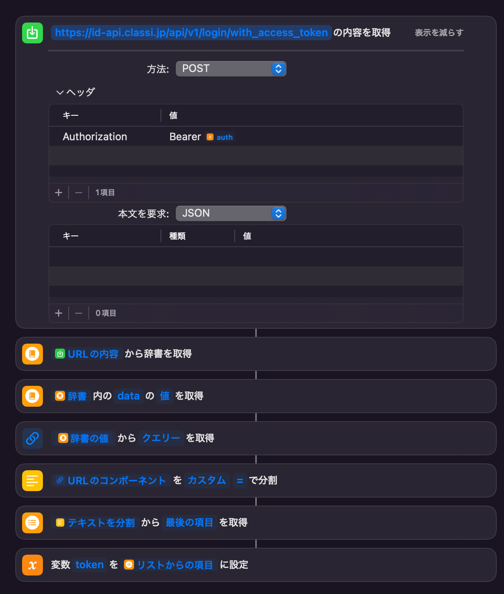
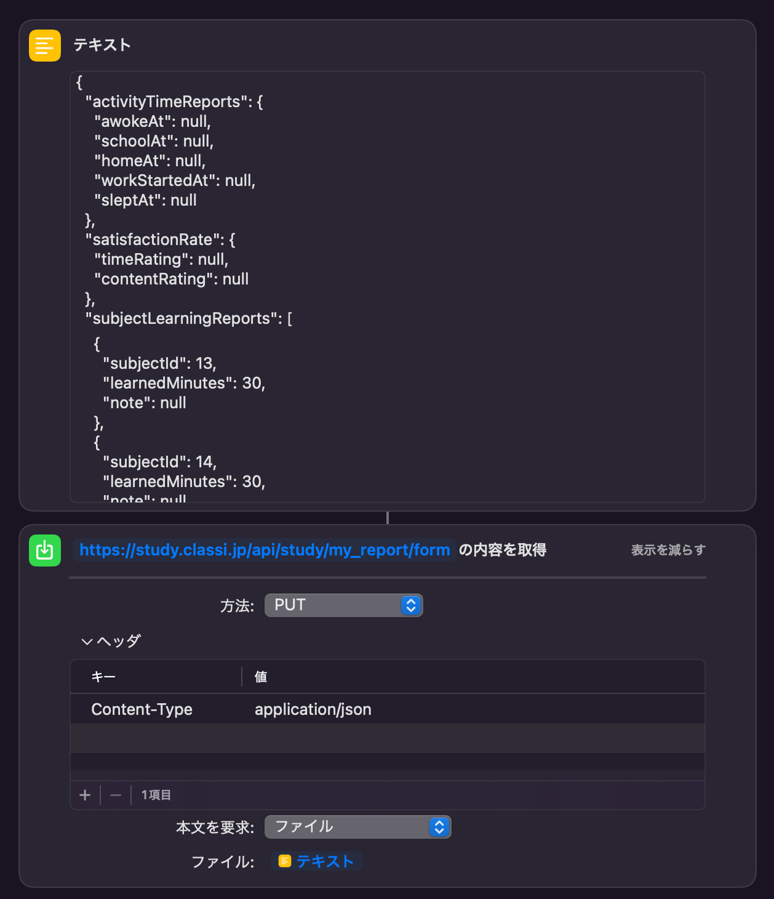
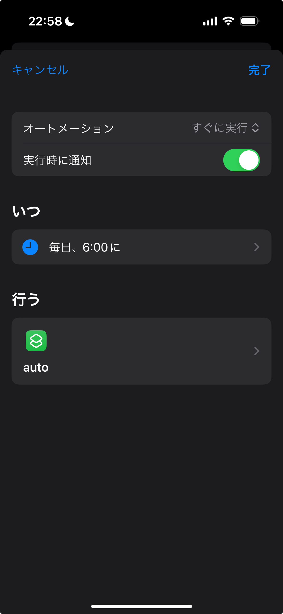

私の通っている学校は[Classi](https://ja.wikipedia.org/wiki/Classi)の学習時間記録の入力を毎日強要してきます。
これがかなり面倒で、Classiアプリも重く、また入力も頻繁に忘れてしまうことも多いので、自動化することにしました。

## どのように自動化するか

数年前にもClassiが導入されていましたが、その時もラズパイでPythonとSeleniumを使って自動化していた記憶があります。

当時は学校ドメインのGoogleアカウントがなかったので、そのままIDでログインしていました。
よって、ブラウザの自動操作だけでうまくいっていたのですが、今度はGoogleのSSOを使用するようになり、
ブラウザ自動化が少々面倒になって諦めていました。

ただ最近どうしても時間記録が面倒だったのと、Shortcutsアプリの可能性を探ってみたかったこともあり、
どうせならAPIを直接触ってやろうかなという試みです。

具体的には

1. アプリの通信を解析し
2. コンピュータ上で試してから
3. iPhone上のShortcutsアプリで実行

できるようにしていきます。

## アプリの通信を解析

### Proxymanを使って通信解析をする

ブラウザの通信解析をしてもSSOあたりの挙動がよくわからなかったので、ログイン情報が保持される
iOSのClassiアプリで通信を解析してみました。

数年前に国産ブラウザが通信傍受をしていたことを突き止めたというブログで、iDevice上の**HTTPSトラフィックも解析できる**「**Charles Proxy**」というアプリを知りました。これを使おうと思いましたが、1000円超のアプリでして、これだけのために払ってられないので、「**Proxyman**」という無料の通信解析アプリを使用しました。

通信を全てこのアプリを通すことになるので危ない気がしますが、パパッとやっちゃえば大きな問題にはならないでしょう(多分)。


### Proxymanの使い方

How to setupに沿ってProxymanを設定すればあとは通信内容がリアルタイムで表示されます。
無料版であれば2つのドメインだけHTTPSの内容を表示できます。

VPNを立ち上げた後、Classiのログイン→時間記録を開いたりしてると通信が発生することが確認できます。

これを地道に再現できれば外部からもアプリ同様の動作ができるわけですね。

試しに時間記録の画面を開くと、以下のようにjsonデータで記録データが見れてしまう。





追記: mitmproxyは無料でHTTPSも解析できるようです。(要PC)

### ログイン・記録する流れ

アプリがどのように通信しているかがわかったので、これから外部からログインしてみます。

流れは冗長なので以下に簡単にまとめておきます。

- Bearer認証を行うためのAuthorizationヘッダのtokenを用意しておく
    - (これはアプリの通信から抜き取るしかないです)
- `id-api.host.xx/` の `api/v1/my/access_tokens/extend`にauthヘッダをつけてPATCH
- `/api/v1/login/with_access_token`にauthヘッダをつけてPOST、アクセストークンを取得。(responseのdataの中の`token=`がそれ)
- `/open?token=上で取得したトークン`でGET
- `study.host.xx/api/current_user`でGET
    - この2つの手順のどちらかだったかでcacheに情報が保存されます(適当)(Shortcutsではcacheを手動で扱えない)
- `/api/study/my_report/form`でformのjsonをPUT


大まかな流れです。

実際に手動で順を追って実行するときは、vscodeの[Thunder Clientの拡張機能](https://www.thunderclient.com/)を使うのがおすすめです。


## Shortcutsに移植

手動で実行できたら、これをShortcutsに移植します。

Shortcutsには「URLの内容を取得」という神アクションがあります。
これは、request method, headerの指定、jsonでのrequestなど、様々なことができます。

上記に記載した手順のアクセストークンの取得でも、responseのjsonを読み取って抜き出すなど高度なこともできます。(以下は無理やりですが...)



### 時間記録のjsonフォーマット

formをつけてPUTすればそのまま時間記録のデータを上書きできます。

```json
{
  "activityTimeReports": {
    "awokeAt": null,
    "schoolAt": null,
    "homeAt": null,
    "workStartedAt": null,
    "sleptAt": null
  },
  "satisfactionRate": {
    "timeRating": null,
    "contentRating": null
  },
  "subjectLearningReports": [
    {
      "subjectId": 13, // 国語
      "learnedMinutes": 30,
      "note": null
    },
    {
      "subjectId": 14, // 数学
      "learnedMinutes": 30, // 勉強時間(min)
      "note": null // コメント
    },
    {
      "subjectId": 15,
      "learnedMinutes": 60,
      "note": null
    },
    {
      "subjectId": 16,
      "learnedMinutes": 0,
      "note": null
    },
    {
      "subjectId": 17,
      "learnedMinutes": null,
      "note": null
    },
    {
      "subjectId": 18,
      "learnedMinutes": null,
      "note": null
    }
  ],
  "studentMessage": null, // コメント
  "date": "2024-06-02" // 日付
}
```

`subjectId`が教科、`learnedMinuted`が勉強時間、`note`がコメントのようです。


### formの送信

PUT requestでformを送信するときにハマりました。そのまま辞書をアクション内に突っ込むと面倒だったので、以下のように行います。

「テキスト」でjsonを使ってから、「本文を要求」を「ファイル」に設定し、それに変数「テキスト」を指定すれば問題なくrequestを送ることができます。



あとは日付を取得→jsonに日付を付け、実行するShortcutを作れば完成です。

## 自動実行

自動入力に関しては、Shortcutsのオートメーションタブから設定できます。



これで完全自動化できました。
