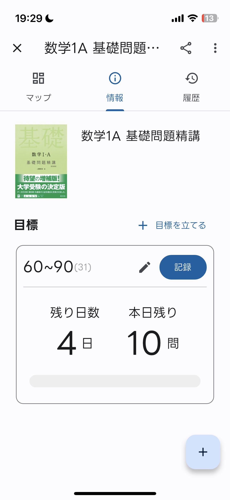
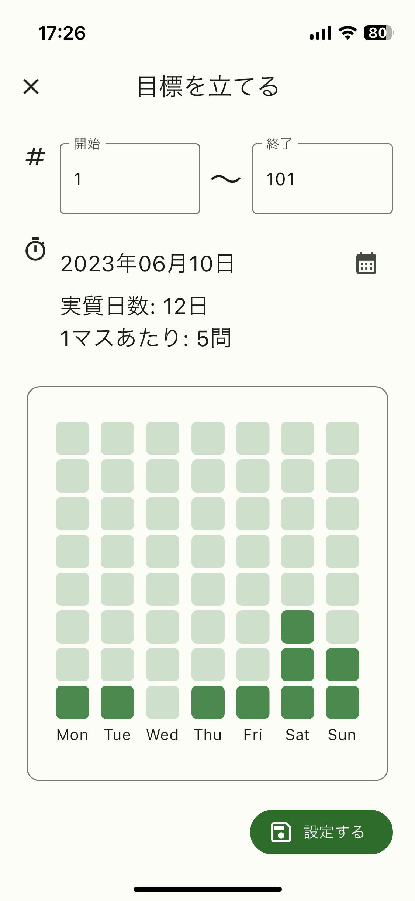
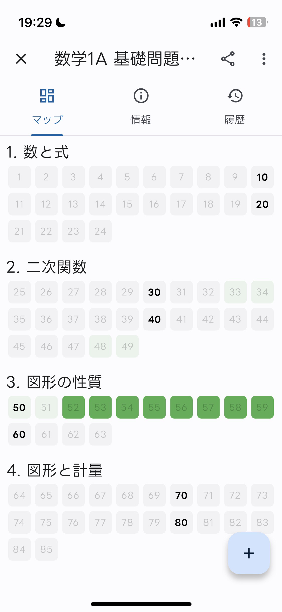

プログラミングが趣味で、高校生のときから個人開発を断続的に行っているのですが、その中でもデータが残っているものを随時以下に追加していこうと思います。

## 学習支援/記録アプリ

高校生のとき、学習した時間や範囲を紙やアプリに記録して勉強のモチベーションを保っていました。高校生として身近な問題を解決する手段としてのアプリ開発を考えたとき、一番最初に勉強関連の話が思い浮かぶことは少なくないと思います。私は勉強のモチベーションを保つためと、復習の機能がとりそろったアプリが市場にないことから、高校１年のときにそういった学習記録・支援アプリを自分で開発することにしました。

具体的な機能としては、まず問題集を登録して、勉強するごとに時間とページを記録します。そのあと、グリッド上にやるべき箇所や適切なタイミングで復習すべきページを表示したり、目安の時間を計算したりする支援機能で勉強を継続させます。
Anki的なユーザーフィードバックに沿った忘却曲線に沿った機能を提供しようとしたものです。これにより、復習のことを何も考えずに勝手にアプリに示された通りのことをやればよくなるようなことを目指しました。

使用した技術は、FlutterとSupabaseのみです。

(スクショの参考書が懐かしい)

頓挫した理由
- データベースの扱いが難しい
	- 大量のアクセスをしない・効率のよいデータベースの設計が難しくて何度も変更してるうちにいやになった。
- 実用が面倒
	- developer accountでは実機にインストールしたものの署名が７日間しか持たない。今でこそsideloadしやすいが、当時はあまり手段がなかった（というか知らなかった）ので、面倒になって実用しつつ検証することができなかった。
- 結局使わなくなった
	- スマホに記録系のアプリそもそもを使わなくなった
- 「そもそも使う？」と考えてしまう/何を作りたいのかわからなくなる
	- 機能を思いつくには結構思いつくのですが、なんでもかんでも取り入れると自分が何をしたいかわからなくなる。
- 勉強が忙しくなった
	- リアルの生活で忙しくなって開発している暇がなくなった。一度中断すると再開するのが難しい。

## Cosense(Scrapbox)リーダー

Cosense(旧Scrapbox)はWeb上で動作するメモアプリですが、Webのみで動作する特性上、ネットの調子が悪かったり圏外になったりしてスマホなどからインターネットに接続できないとき、オフラインでメモにアクセスできなくなります。キャッシュから一部の閲覧したことのあるメモは開くことができますが限定的なので、ネイティブのモバイルアプリでデータを読み込んでオフラインで自分のメモを確認できるようにしました。

使用した技術はFlutterのみです。

頓挫した理由
- 構文解析が難しい
	- scrapbox記法で書かれたテキストデータをDartで分析してそれをWidgetに変換する処理を行うので、構文解析を無計画で実装しはじめてしまったので大変なコードを生み出した。
- そもそもオフラインで使うことがあまりない
	- 「いざというときのために」的な意味合いのアプリなので、日常使いしなくなって使わない。編集機能があれば使えたが、WSYIWYMなどの実装も難しくてあきらめた。

## その他小さいもの

### hlTODO

TODOリストに着手できない理由として大きい「目標が高すぎる」問題を解決するために作ったTODOアプリです。TODOリストを設定するときに、「最高目標」と「最低目標」を作ります。例えば、「本を読み進める」ことを目標とするとき、「本を15ページ読む」ことを最高目標としつつ、「本を３ページ読む」ことを最低目標とします。一日にとりあえずタスクの最低目標を達成したら御の字という雰囲気を出すことによって、TODOを消化しやすくします。

開発は頓挫していないのですが，新機能の追加が面倒でしばらく触れてません．．．

### FlutterでWordle

とにかく何かのアプリを１日作りたかったので、WordleをそのままFlutterで作ったりしていました。
